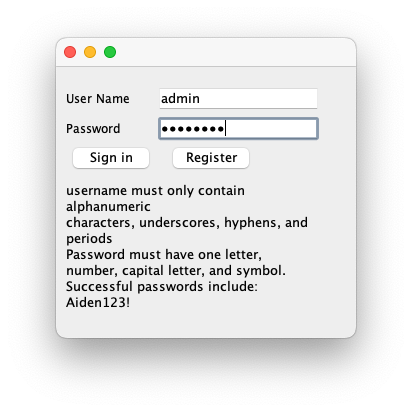
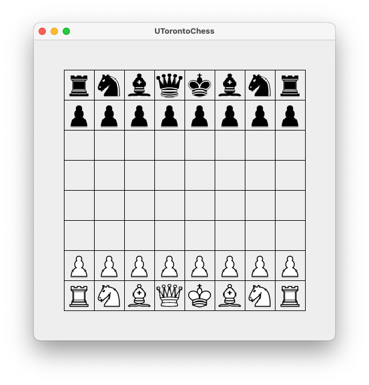

# UToronto Chess

`UToronto Chess` is a chess program written in Java. It is a project for the course CSC207 at the University of Toronto. 

## Features
- Registration and login system, with SQLite persistence. 
- Graphical UI with menu screen, game board, and chess sprites. 
- Full support for local chess games. 

## Out of Scope
- Chess AI 
- Online Games 
- ELO system 

## How to run the program

1. Download the latest release from [here](https://github.com/CSC207-2022F-UofT/course-project-utoronto-chess.git)
2. Open the project in IntelliJ
3. Run the `main()` method in the `UTorontoChess` class

### Register/Login

### Game Board

